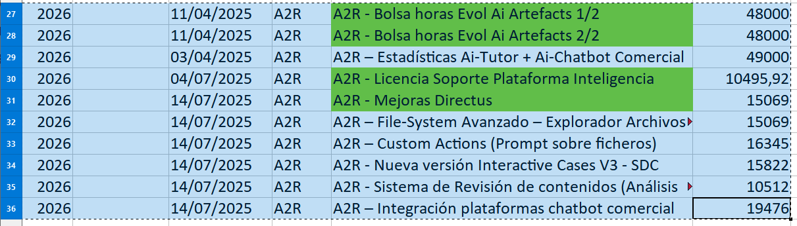

# Ejemplo

Primer párrafo. En un lugar de la **mancha** de cuyo nombre no quiero acordarme...

## Subtítulo

Hola *esto* es un fichero de texto.

Una lista de puntos

- Pimero
- Segundo
  - Sub punto
  - Otro

1. Primero
2. Segundo

Esto en un [vínculo](https://www.google.com) a un sitio.

Como se puede ver en esta imagen:

|Primero|Segundo|Tercero|
|-------|-------|-------|
|      1|      2|      5|
|      1|     52|     15|

